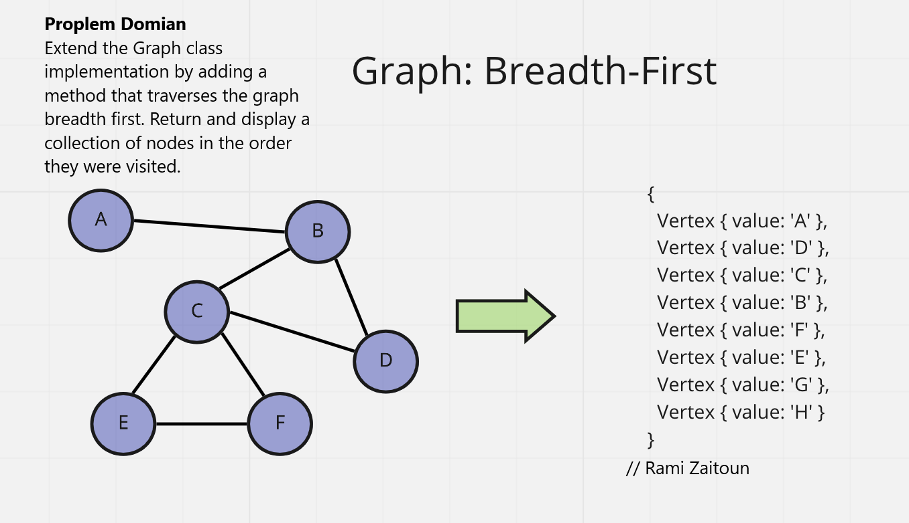
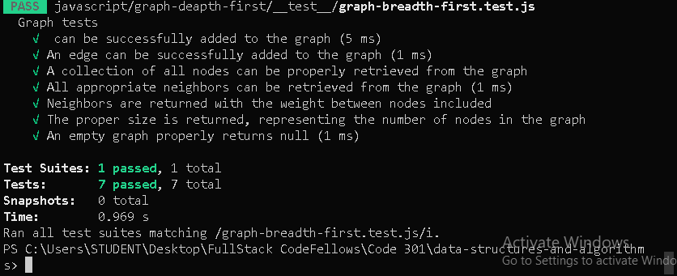

# Graph Breadth First

Code Challenge: Graph Breadth First

# Author : Rami Zaitoun

## Challenge

Extend the Graph class implementation by adding a method that traverses the graph breadth first. Return and display a collection of nodes in the order they were visited.

```javascript
graph.breadthFirst(startVertex);
```

## Whiteboard Process



## Testing 



## Approach & Efficiency

Big O time complexity:

`graph.addVertex()` - O(1)
`graph.addDirectedEdge(startVertex, endVertex, weight = 0)` - O(1)


# Resource 
[](https://www.youtube.com/watch?v=cWNEl4HE2OE)


