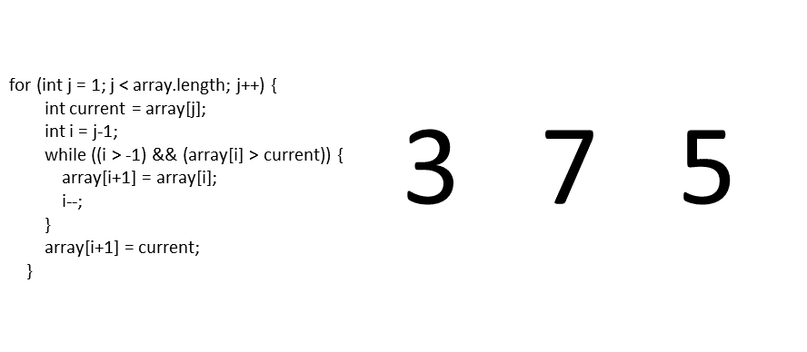
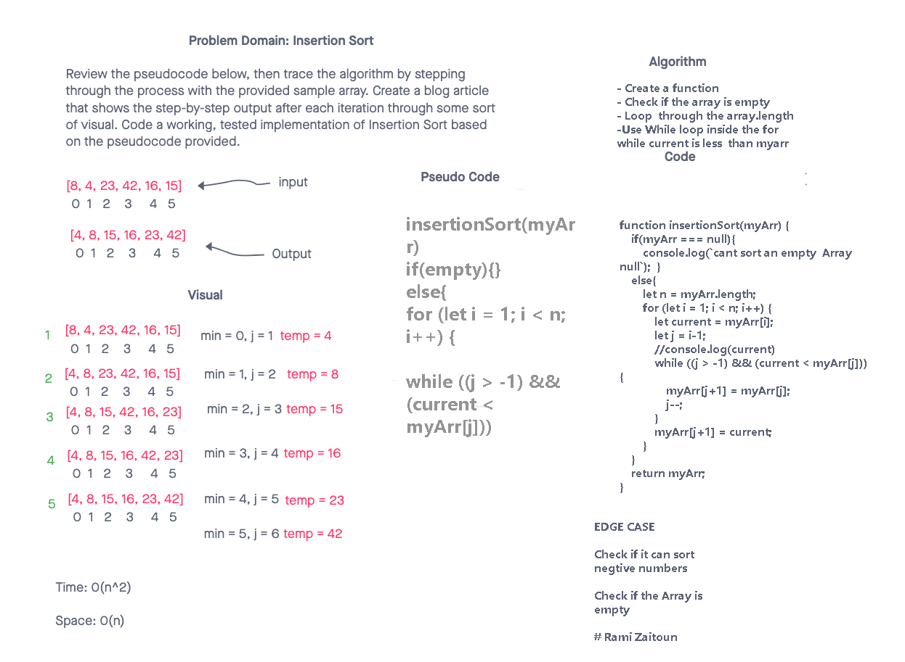
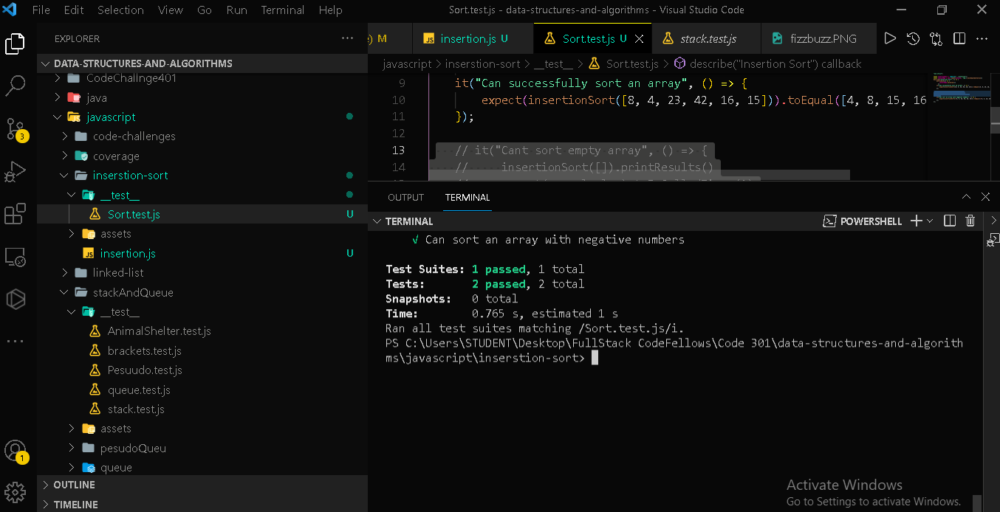

# Insertion Sort

The idea behind Insertion Sort is often compared to the way people sort a hand of cards while playing

###

Here's a visual representation of how Insertion Sort works:

### credit: https://stackabuse.com/insertion-sort-in-javascript/




```Javascript

function insertionSort(myArr) {
    if(myArr === null){
        console.log(`cant sort an empty  Array  null`);
    }
    else{
        let n = myArr.length;
        for (let i = 1; i < n; i++) {
            let current = myArr[i];
            let j = i-1; 
            //console.log(current)
            while ((j > -1) && (current < myArr[j])) {
                myArr[j+1] = myArr[j];
                j--;
            }
            myArr[j+1] = current;
        }
    }
   
    return myArr;
}

```

# UML




# Test Sorting

